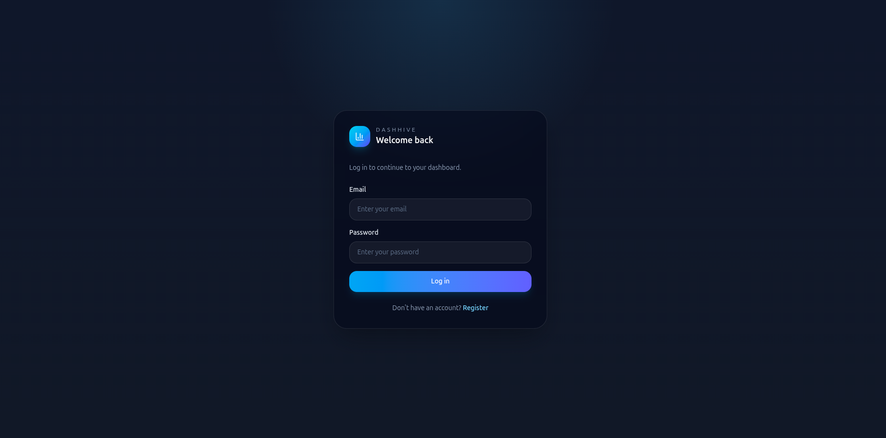
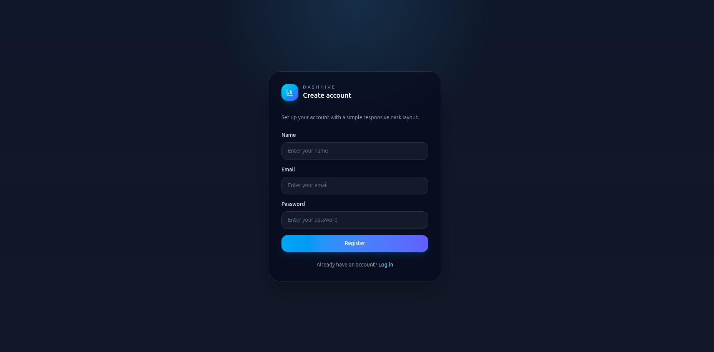
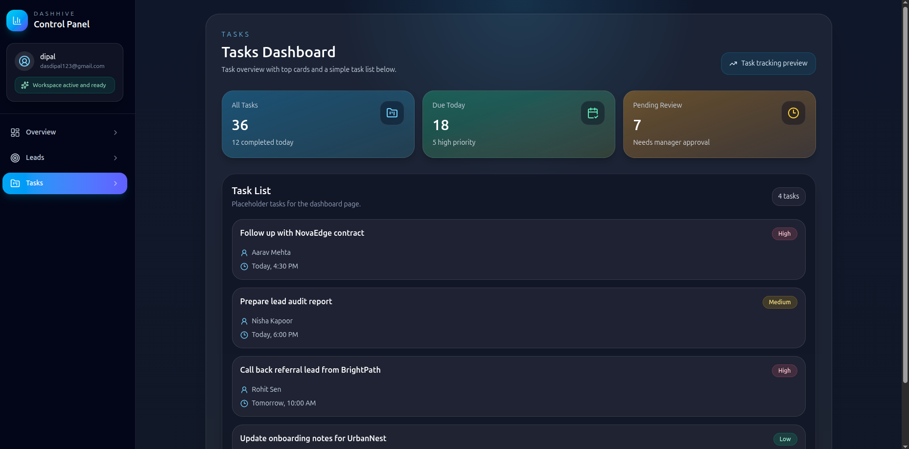
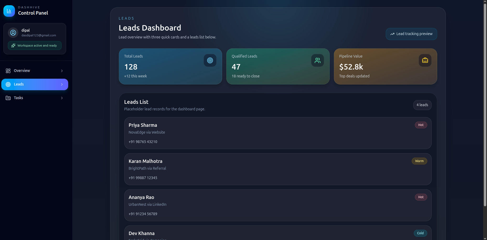
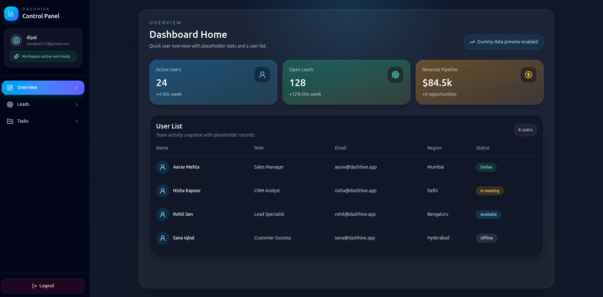

# Dashhive

# Screenshots











## Folder Structure

```text
Dashhive/
├── backend/
│   ├── server.js
│   ├── package.json
│   └── src/
│       ├── config/
│       ├── controllers/
│       ├── middlewares/
│       ├── models/
│       ├── routes/
│       └── utils/
├── frontend/
│   ├── package.json
│   ├── public/
│   └── src/
│       ├── api/
│       ├── assets/
│       ├── components/
│       ├── context/
│       ├── layout/
│       ├── pages/
│       └── router/
└── README.md
```

## Frontend Structure

- `src/api/` : Axios client and API configuration
- `src/assets/` : static frontend assets
- `src/components/` : reusable UI components like sidebar and protected route
- `src/context/` : authentication context and shared app state
- `src/layout/` : dashboard layout wrapper
- `src/pages/` : login, register, and dashboard pages
- `src/router/` : route configuration for the application
- `public/` : public static files

## Frontend Pages Structure

- `src/pages/Login.jsx` : user login page
- `src/pages/Register.jsx` : user registration page
- `src/pages/dashboard/Home.jsx` : dashboard overview page
- `src/pages/dashboard/Leads.jsx` : leads dashboard page
- `src/pages/dashboard/Tasks.jsx` : tasks dashboard page

## Backend APIs

### Auth APIs

- `POST /api/auth/register`
  Creates a new user account

- `POST /api/auth/login`
  Authenticates a user and returns JWT token with user details

## Features

### Frontend

- Responsive login page
- Responsive register page
- JWT-based authentication flow
- Protected dashboard routes
- Dashboard sidebar with mobile hamburger menu
- Dashboard pages for overview, leads, and tasks
- Toast notifications for login and register status

### Backend

- User registration API
- User login API
- Password hashing with bcrypt
- JWT token generation
- Request validation with Zod
- MongoDB user storage with Mongoose
- Centralized error handling
- REST API for authentication

## Technology

### Frontend

- React
- Vite
- React Router DOM
- Tailwind CSS
- Axios
- Lucide React
- React Toastify

### Backend

- Node.js
- Express
- MongoDB
- Mongoose
- bcryptjs
- JSON Web Token
- Zod
- Morgan
- CORS
